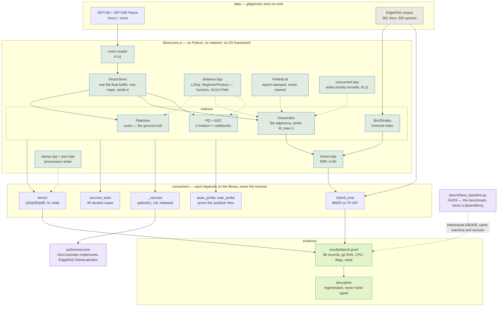

# VecCore

**An HNSW vector index with Product-Quantization compression and hybrid dense+sparse retrieval,
written from scratch in C++17 and benchmarked against FAISS.**

[](https://github.com/Tejas544/VecCore/actions/workflows/ci.yml)
[](LICENSE)

> **Status: complete.** All six phases shipped and gated. HNSW, Product Quantization, BM25+RRF
> and concurrent search, benchmarked head-to-head against FAISS on identical data with matched
> parameters and matched thread counts. Since the last gate: **persistence** (878× cheaper to
> reopen an index than to rebuild it), incremental insert and PQ reachable from Python, and the
> **VecCore swap landed inside EdgeRAG** with the retrieval delta measured by EdgeRAG's own harness.
> Every number below traces to a JSON record in [`results/`](results/) carrying the git SHA, CPU,
> compiler, flags, thread count and RNG seed that produced it — see `CONTEXT.md` D10. All 89 records
> are stamped `trusted: true` from a clean tree and a Release build. If you find a number here with
> no record behind it, that is a bug in the README, and B-12 is the entry about the last time it
> happened.

New to vector search? **[`WHAT_IS_THIS.md`](WHAT_IS_THIS.md)** explains the whole problem from zero
background — what a vector is, why brute force fails, and what HNSW and PQ actually do.

| Document | What it holds |
|---|---|
| [`WHAT_IS_THIS.md`](WHAT_IS_THIS.md) | The no-background explanation, and the honest answer to "isn't this solved?" |
| [`PLAN.md`](PLAN.md) | Phase-by-phase build plan, schedule, cut order, gates |
| [`CONTEXT.md`](CONTEXT.md) | Every design decision with the alternative that was rejected |
| [`BUGS.md`](BUGS.md) | Bug log, defused landmines, and ~35 pre-registered failure modes |
| [`02_VECCORE.md`](02_VECCORE.md) | The original specification |

---

## Build

Linux only, and deliberately so — `CONTEXT.md` D2 records why (sanitizers, TSan, valgrind, and a
clean pybind11 story; `BUGS.md` L-01 is the finding that forced it).

```bash
sudo apt install -y build-essential cmake ninja-build valgrind python3-venv python3-pip pkg-config
```

Release — the only configuration any published number may come from:

```bash
cmake -S . -B ~/veccore-build -G Ninja -DCMAKE_BUILD_TYPE=Release && cmake --build ~/veccore-build
```

Debug, with AddressSanitizer and UBSan on by default:

```bash
cmake -S . -B ~/veccore-build-debug -G Ninja -DCMAKE_BUILD_TYPE=Debug && cmake --build ~/veccore-build-debug
```

**The Phase 0 gate.** This must abort with a heap-buffer-overflow report. If it prints
`probe survived`, the sanitizers are not active and the plan's main defence against memory bugs is
imaginary:

```bash
~/veccore-build-debug/bin/asan_probe
```

**ThreadSanitizer** is a third, separate build (TSan and ASan cannot coexist):

```bash
cmake -S . -B ~/veccore-build-tsan -G Ninja -DCMAKE_BUILD_TYPE=RelWithDebInfo -DVECCORE_TSAN=ON && cmake --build ~/veccore-build-tsan
```

`setarch -R` is **not optional** — TSan maps shadow memory at fixed addresses and this kernel's
ASLR range overlaps them, aborting at startup nondeterministically (`BUGS.md` L-09). The
personality flag is inherited by children, so wrapping `ctest` covers every test:

```bash
setarch -R ctest --test-dir ~/veccore-build-tsan --output-on-failure
```

And the Phase 5 gate — this one must *report a race*, proving TSan is genuinely active:

```bash
setarch -R ~/veccore-build-tsan/bin/tsan_probe
```

Python side — Ubuntu 24.04 enforces PEP 668, so this needs a venv rather than a bare
`pip install`:

```bash
python3 -m venv ~/veccore-venv && ~/veccore-venv/bin/pip install numpy matplotlib faiss-cpu pybind11
```

FAISS is a **benchmark, not a dependency** (`02_VECCORE.md` §2). It is imported only by
`bench/faiss_baseline.py`, never by anything in `include/` or `src/`.

## Data

```bash
bash scripts/fetch_sift.sh && ~/veccore-venv/bin/python scripts/make_fixture.py
```

SIFT1M (1M × 128-dim, published ground truth) for benchmarks; a 10,000-vector fixture with exact
ground truth for tests. `CONTEXT.md` D3 explains why those are two different things.

## Test and measure

```bash
ctest --test-dir ~/veccore-build --output-on-failure
```

```bash
~/veccore-build/bin/bench --tag phase0_rails --data-dir ~/veccore-data
```

`bench` refuses to write a record from a Debug, sanitized, or dirty-tree build unless you pass
`--allow-untrusted`, which stamps `trusted: false` and the reason into the record. An ASan build
runs several times slower than Release, and a latency copied out of one is indistinguishable from a
real regression once it reaches a plot.

## Continuous integration

[`.github/workflows/ci.yml`](.github/workflows/ci.yml) runs four jobs on every push: the Release
build with **95 doctest cases and 45 Python tests**, the ASan+UBSan build, the TSan build, and a
`pip install .` that imports the package from outside the source tree.

**Two of those jobs assert that a binary fails.** `asan_probe` must abort and `tsan_probe` must
print a race report; if either one succeeds quietly, CI fails. That inversion is the whole point —
a clean sanitizer run proves nothing unless the sanitizer can be shown to fire, which is L-01's
lesson and the reason this repo has probes at all. A green check here means the detectors are real,
not merely that nothing was detected.

**No benchmarks run in CI, deliberately.** SIFT1M is a 168 MB download and a 19-minute
single-threaded build, and a latency measured on a shared runner with unknown neighbours would
violate `CONTEXT.md` D10 in the one place that rule matters most. Correctness is portable;
performance is not.

---

## Architecture



**Two properties of this graph are the design, and both are worth defending in an interview.**

**The arrows into `libveccore.a` all point one way.** The library links `Threads` and nothing else —
no pybind11, no numpy, no HTTP, and emphatically no FAISS. `_veccore`, `bench`, the tests and the
probes are separate CMake targets that depend on it; none of it depends on them. That is why the
same code is a library, a benchmark, a test subject and a Python extension without a single
`#ifdef`, and it is why `pip install faiss-cpu` failing could never break a build of the thing being
measured.

**The evidence path is a pipeline, not a habit.** `bench` stamps provenance into every record,
`plots.py` reads only records, and the README reads only plots. No number in this file was typed by
a human, which is the property that makes B-12 — an unmeasured number that reached the limitations
section — a *bug with an entry* rather than an ordinary bit of prose.

*(One honest caveat on the boundary: `PLAN.md` §3 says the library "knows nothing about pybind11,
JSON, or FastAPI." Two of those three are exactly true. The library does carry a small JSON
**writer** in `json.hpp`/`stamp.cpp`, because provenance stamping is a property of the measurement,
not of the harness — the diagram shows it inside the library because that is where it is.)*

## Benchmarks

i5-11400H, **single thread**, Release `-O3 -march=native`, WSL2 Ubuntu 24.04, GCC 13.3.
Every row traces to a record in [`results/bench.jsonl`](results/bench.jsonl) carrying the git SHA,
CPU, compiler, flags, RNG seed and parameters it was produced under. Regenerate with
`bench/plots.py`; nothing here is typed by hand.


**SIFT1M — 1,000,000 × 128, published ground truth, k=10**

| index | params | recall@10 | QPS | p50 | p99 | vs brute force |
|---|---|---|---|---|---|---|
| brute force | exact | 0.9995 † | 12.9 ± 0.7 | 76.0 ms | 103.6 ms | 1× |
| HNSW | ef=40 | 0.9290 | 3,288 ± 138 | 0.30 ms | 0.55 ms | 254× |
| **HNSW** | **ef=80** | **0.9755** | **1,934 ± 15** | **0.53 ms** | **0.83 ms** | **150×** |
| HNSW | ef=160 | 0.9935 | 1,079 ± 10 | 0.95 ms | 1.51 ms | 83× |
| HNSW | ef=320 | 0.9987 | 595 ± 15 | 1.71 ms | 2.79 ms | 46× |

† Brute force is exact by construction. The 0.9995 is **one distance tie in 2000**, not an error:
query 93's published neighbour 274922 and our 196106 sit at d² = 42192.0 exactly, and an independent
numpy implementation makes the same choice. `scripts/diagnose_recall.py` proves it rather than
asserting it — that script is the answer to "why isn't it 1.0?".

**Build, memory, and the graph itself** (M=16, ef_construction=200, seed=42):

| | |
|---|---|
| build time | **1,139 s** single-threaded — see limitations, this is the weakest number here |
| level histogram | 1,000,000 / 62,312 / 3,911 / 250 / 21 / 1 |
| successive ratios | 0.0623, 0.0628, 0.0639 — against the predicted 1/M = 0.0625 |
| mean degree, layer 0 | 25.7 (cap 32) |
| graph | 140.7 MiB on top of 488.3 MiB of vectors — **28.8% overhead** |

The level histogram is not decoration. `mL = 1/ln(M)` is easy to get wrong (`1/M` and `ln(M)` are
both plausible), nothing errors when you do, and the only symptom is a badly shaped hierarchy. The
ratios matching 1/M to three decimal places is the evidence that it is right.

### Head-to-head with FAISS — SIFT1M, matched `M`/`ef_construction`/`ef_search`, both single-threaded

This is the table the project exists to be able to show. `02_VECCORE.md` set the bar at
*"within 2–3× of FAISS is a good solo result."*

| ef_search | VecCore recall@10 | FAISS recall@10 | VecCore QPS | FAISS QPS | VecCore p99 ms | FAISS p99 ms | FAISS faster by |
|---|---|---|---|---|---|---|---|
| 10 | 0.7244 | 0.7044 | 8,033 | 14,001 | 0.256 | 0.183 | 1.74x |
| 20 | 0.8409 | 0.8357 | 5,397 | 9,023 | 0.330 | 0.247 | 1.67x |
| 40 | 0.9290 | 0.9288 | 3,288 | 5,739 | 0.550 | 0.355 | 1.75x |
| 80 | 0.9755 | 0.9770 | 1,934 | 3,216 | 0.832 | 0.567 | 1.66x |
| 160 | 0.9935 | 0.9946 | 1,079 | 1,778 | 1.513 | 1.079 | 1.65x |
| 320 | 0.9987 | 0.9987 | 595 | 956 | 2.791 | 2.221 | 1.61x |
| **build** | | | | | | | **1,139 s vs 753 s = 1.51x** |

*Generated by `bench/plots.py` into `docs/plots/head_to_head.md` and pasted whole. It is built by
pairing records on `ef_search`, so a row appears only when both sides were measured at the same
parameters in the same interleaved session — which is also how the `ef=20` row and the p99 columns
came back after an earlier hand-assembled version of this table quietly dropped them.*

**Recall matches to within 0.002 at every point on the curve** — slightly ahead at low `ef_search`,
slightly behind at high. That is the correctness result: this HNSW builds a graph of equivalent
quality to the reference implementation. Throughput is **1.6–1.75× behind**, inside the spec's
target band, and build time is 1.51× behind.

**The p99 columns are the more interesting half, and they are kinder than the throughput ratio.**
At the headline ef=80 point FAISS's p99 is 0.567 ms against our 0.832 ms — **1.47×**, against a
1.66× gap on QPS. The tail is where a serving system actually lives, so the number that matters most
is the one where the gap is narrowest. Both sides widen at ef=320 (2.221 vs 2.791 ms) because the
beam search does more work per query and the variance grows with it.

`faiss.omp_set_num_threads(1)` is set explicitly (P-32) — FAISS defaults to every core, and
comparing that against a single-threaded search would be a 6× error in its favour and the first
thing anyone competent would ask about.

**PQ, same treatment** — `IndexPQ`, same `m`, same 100k training subsample:

| m | compression | VecCore recall@10 | FAISS recall@10 | VecCore QPS | FAISS QPS |
|---|---|---|---|---|---|
| 8 | 64× | **0.3125** | 0.3101 | 164 | 191 |
| 32 | 16× | **0.7186** | 0.7059 | 55 | 62 |

Marginally ahead of the reference on recall, at 0.85–0.89× its throughput.

### Product Quantization — compression, and what it costs


| m | B/vector | compression | ADC recall@10 | **+ exact rerank top-100** | ADC QPS |
|---|---|---|---|---|---|
| 4 | 4 | 128× | 0.1071 | 0.4202 | 261 |
| 8 | 8 | 64× | 0.3125 | 0.7779 | 164 |
| 16 | 16 | 32× | 0.5344 | **0.9656** | 114 |
| 32 | 32 | 16× | 0.7186 | **0.9987** | 55 |

Reconstruction MSE falls monotonically with `m` — 39924 → 24165 → 10847 → 3665 — which is the
check that the subspace slicing is right.

**Against FAISS `IndexPQ`, same data, same `m`, both pinned to one thread:**

| m | VecCore recall@10 | FAISS recall@10 | VecCore QPS | FAISS QPS | codebook train |
|---|---|---|---|---|---|
| 8 | **0.3125** | 0.3101 | 164 | 191 (1.17×) | 86.5 s vs **1.7 s** |
| 32 | **0.7186** | 0.7059 | 55 | 62 (1.12×) | 114.2 s vs **3.7 s** |

Recall marginally ahead of the reference implementation, throughput at 0.85–0.89× of it, and
codebook training **50× slower** — see limitations, that gap is real and has a known cause.

**PQ is a memory result, not a speed result**, and that distinction is the point. It gives 16–128×
compression but only 4–20× speed over brute force — nothing like HNSW's 150×. That is not a
shortfall, it is what PQ *is*: it still scans all one million codes, it just makes each comparison
cheaper (4–32 bytes read instead of 512). **HNSW wins by not looking at most of the data; PQ wins by
making all of the data small.**

One honesty item, enforced in the harness rather than trusted to prose: **reranking needs the full
vectors resident**, so a reranking configuration's real footprint includes all 488 MB. `bench`
records code bytes, codebook bytes and total footprint as separate fields and never conflates them.
Quoting 64× compression for a configuration that keeps the uncompressed vectors in RAM would be
exactly the overclaiming `WHAT_IS_THIS.md` §10 criticises.

### Hybrid retrieval — BM25 on EdgeRAG's real corpus

362 documents, **650 real held-out queries**, measured against EdgeRAG's own TF-IDF implementation
with an identical tokenizer, so the comparison isolates the three things that actually differ.

| retriever | recall@1 | recall@5 | recall@10 | ÷ ceiling | p50 latency |
|---|---|---|---|---|---|
| TF-IDF (EdgeRAG today) | 0.0400 | 0.1846 | 0.2738 | 48.0% | 0.0359 ms |
| **BM25 (VecCore)** | **0.0446** | **0.1923** | **0.2862** | **50.0%** | **0.0034 ms** |
| RRF(BM25, TF-IDF) | 0.0400 | 0.1862 | 0.2769 | 48.4% | 0.0432 ms |

**BM25 wins on both axes: +4.17% relative recall@5 and 11× lower latency.** The latency half is
algorithmic rather than a micro-optimisation — an inverted index touches only documents containing
a query term, while the TF-IDF implementation scores all 362.

**The ceiling column is not decoration.** 112 of 362 documents have no OCR text at all, so 400 of
650 queries are unreachable by *any* text retriever. **No text-only method can exceed recall
0.3846 on this corpus.** Quoting these numbers against 1.0 would make a 50%-of-achievable result
look like a 19% failure.

**RRF made things worse, and that is reported rather than dropped.** `PLAN.md` §4.5 pre-committed
to reporting the result either way, before it was known. The investigation:

```
mean top-10 overlap between BM25 and TF-IDF : 0.4915
BM25 finds the gold doc, TF-IDF does not    :  13 queries
TF-IDF finds it, BM25 does not              :   8 queries

oracle fusion recall@5 (always pick correctly) : 0.2046
BM25 alone                                     : 0.1923
RRF                                            : 0.1862
```

So complementary signal genuinely exists — **+6.4% is on the table** — and RRF captures none of it.
**RRF fuses by rank alone, which is exactly what makes it tuning-free and also what makes it
authority-blind:** it has no way to know one input dominates, so it averages a stronger ranker with
a weaker one that mostly agrees. That is the right bet for *complementary* retrievers and the wrong
one for *correlated* ones. Full write-up in [`BUGS.md`](BUGS.md) B-08.

A genuine dense+sparse hybrid could not be measured here — EdgeRAG's dense signal was measured to
be noise (`DEFAULT_ALPHA = 0.0`), so the only second retriever available is another lexical one
over the same tokens. That is a limitation of the data, named rather than substituted with a
number that flatters.

### Concurrency — read scaling, and a lock that stopped accepting writes


Read-only throughput, HNSW `ef_search=64`, 3 trials, each thread taking a **disjoint** slice of the
query set (P-28 — all threads issuing the same query would measure cache behaviour, not
concurrency):

| threads | n=10K (4.9 MiB, fits in 12 MB L3) | n=200K (98 MiB, exceeds L3) |
|---|---|---|
| 1 | 10,347 QPS (1.00×) | 3,651 QPS (1.00×) |
| 2 | 20,701 (2.00×, 100%) | 6,341 (1.74×, 87%) |
| 4 | 34,829 (**3.37×**, 84%) | 10,357 (**2.84×**, 71%) |
| 6 | 42,129 (4.07×, 68%) | 12,267 (3.36×, 56%) |
| 8 | 51,332 (4.96×, 62%) | 14,195 (3.89×, 49%) |
| 12 | 57,825 (5.59×, 47%) | 15,172 (4.16×, 35%) |

**The lock is not what limits scaling, and there is a control that proves it.** Running the same
sweep with the lock *entirely removed* gives 14,994 QPS at 200K/12 threads against 15,172 with
`shared_mutex` — a ~3% spread, inside trial noise. `BUGS.md` P-30 pre-registered the trap:
*"it stops scaling because of lock contention"* is the plausible sentence, and it is **wrong here**.

What does limit it, isolated by changing only the working-set size: the out-of-cache curve loses
**~12 points of efficiency at every thread count**, which is memory bandwidth. Past 6 threads both
curves flatten, because threads 7–12 are hyperthreads sharing execution units with a loop that
already saturates them — 8→12 threads buys 3.89→4.16×. Turbo clock reduction as more cores
engage is a third contributor and is not separated out; saying so beats attributing the residual to
whichever cause sounds best.

### The bug worth reading: 4 readers stop the index accepting writes


`std::shared_mutex` on libstdc++ is a `pthread_rwlock_t`, and **glibc's default is
reader-preferring**. Under continuous search load the reader count never reaches zero, so a writer's
`unique_lock` never becomes grantable. Measured, 200 inserts at n=200K:

| lock mode | readers | inserts completed | insert p50 | insert p99 |
|---|---|---|---|---|
| `shared_mutex` | 0 | 200/200 | 0.70 ms | 1.32 ms |
| `shared_mutex` | 2 | 200/200 | 28.40 ms | 237 ms |
| **`shared_mutex`** | **4** | **5/200 in 36 s** | **8,242 ms** | **11,902 ms** |
| `writer_priority` | 0 | 200/200 | 0.70 ms | 1.31 ms |
| `writer_priority` | 2 | 200/200 | 0.75 ms | 1.32 ms |
| **`writer_priority`** | **4** | **200/200 in 159 ms** | **0.76 ms** | **1.54 ms** |

Not a slowdown — a cliff. The fix is a ~10-line turnstile: a plain mutex that readers touch briefly
on the way in and that a **writer holds across its whole wait**, so new readers queue behind it
instead of overtaking it. Insert p99 under 4 readers goes **11,902 ms → 1.54 ms**, and the read
scaling table above shows it costs read throughput nothing measurable. It is now the default.
Full write-up in [`BUGS.md`](BUGS.md) B-11.

A vector index is *the* canonical many-readers-occasional-writer workload, which makes this the
wrong standard-library default for exactly this use case — and `std::shared_mutex` exposes no way
to change it.

**Verified with ThreadSanitizer**, and TSan itself is verified: `tools/tsan_probe.cpp` deliberately
calls the non-thread-safe overload from 4 threads and TSan reports the expected race on the epoch
counter. A clean sanitizer run proves nothing unless the sanitizer can be shown to fire (B-10, L-01).

**Memory layout (D5)** — 200,000 vectors, 98 MiB, past this CPU's 12 MB L3:


| access pattern | flat | naive `vector<vector<float>>` | flat advantage |
|---|---|---|---|
| sequential | 63.3 QPS | 55.3 QPS | 1.14× |
| random | 25.4 QPS | 16.2 QPS | **1.56×** |

Layout barely matters for a sequential scan — the prefetcher handles both. It matters under random
access, **which is what HNSW does**, since graph traversal visits neighbours in an order no
prefetcher can predict. The first version of this benchmark reported the naive layout as *faster*;
`BUGS.md` B-05 explains why, and that half is more interesting than the result.


Latency percentiles across the `ef_search` sweep, which is the reason `bench` times **per query**
rather than amortising a batch: at ef=80 the p99 is 0.83 ms against a 0.53 ms p50, and you cannot
recover that ratio from a mean. FAISS's p99 at the same point is 0.567 ms — measured in the same
interleaved session as the head-to-head table above, and 1.47× ahead, which is a slightly narrower
gap than the 1.66× it holds on throughput.

### Persistence — 878× cheaper to reopen than to rebuild

An index that only exists inside the process that built it is one you pay for on every restart, and
here that bill is large enough to be the whole argument. Measured on SIFT1M, 1,000 queries, one
process (`bench --index persist`):

| | |
|---|---|
| build the graph | **1,469 s** |
| `save` | **1.24 s** |
| `load` | **1.67 s** |
| file on disk | **627 MiB** (488 MiB vectors + 141 MiB graph) |
| **rebuild ÷ load** | **878×** |
| equivalence | **10,000 results compared, 0 mismatched** |

**The equivalence row is not a formality — `bench` refuses to report the timings without it.** A
load that is fast and wrong is not a result, so the harness re-runs every query against both the
original and the reloaded index and exits non-zero on any disagreement. 878× would be trivially
achievable by loading nothing.

*One honest wrinkle:* the build here is **1,469 s** against the **1,139 s** recorded at the Phase 2
gate — same machine, same parameters, same seed, 29% apart. Nothing changed in the insert path; this
is a laptop under a different thermal and background-load state, and it is exactly what `PLAN.md` §1
warns about when it says to interleave compared configurations. The ratio above uses the build this
run actually measured. Against the Phase 2 number it would be 682×, which is the same story told
with a number this record cannot vouch for.

**PQ is the case with the sharper argument even though the numbers are smaller.** Codebook training
takes **86.5 s** and produces a file of codes, not vectors — 30.6 MiB at m=32 against 488 MiB of raw
data. Reopening it is milliseconds.

```python
index.save("index.vci")
index = veccore.HnswIndex.load("index.vci")     # vectors included, self-contained

pq.save("pq.vci")
pq = veccore.PqIndex.load("pq.vci")             # codes + codebooks; search() works immediately
pq = veccore.PqIndex.load("pq.vci", vectors=X)  # ...and now search_rerank() does too
```

**The format is a header, not a `memcpy` to a file, and each field is there for a specific silent
failure.** Writing `reinterpret_cast<const char*>(v.data())` to disk is three lines and works until
it does not:

| Failure | Defence | Without it |
|---|---|---|
| Wrong file entirely | magic bytes, checked first | a graph of garbage ids that still returns k results |
| Format drift | version, exact match | every field after the changed one misparses; recall just gets worse |
| Different machine | endian probe + `sizeof` fields | the same bytes mean different numbers |
| Truncated / corrupted | FNV-1a checksum + length guards | a write interrupted at 90% whose header parses cleanly |

**Only the first has an obvious symptom.** The other three produce *plausible* indexes, which on this
project means quietly wrong recall — the same class as B-01 and B-07. Nine tests in
`tests/test_serialize.cpp` corrupt a good file in each of those ways and assert it is **refused**.

The format is **native-endian by design** and detects a mismatch rather than claiming to work across
one. "I detect it and refuse" is a defensible position; silently producing wrong distances is not.

**The RNG state travels with the file**, so an index that is saved, loaded, and then inserted into
builds the identical graph to one that was never saved. Level assignment is a random draw, so
dropping it would reintroduce P-03's unreproducibility one level down, in a place nobody would think
to look. `CONTEXT.md` D15 has the full reasoning, including why HNSW files carry their vectors and PQ
files deliberately do not.

**And the bug it cost:** `PyHnsw::load` returned by value, moving the vector store out from under the
reference the index holds into it — wrong neighbours first, then a segfault. The hazard is documented
in `HnswIndex::load`'s own doc comment, and the binding reproduced it inside the hour, because at a
language boundary an ownership constraint stops looking like one. `BUGS.md` B-15. A comment is not an
invariant; deleted move constructors are.

### Integrating with EdgeRAG — the swap is landed, not described


`python/veccore/edgerag.py` implements EdgeRAG's `RetrievalIndex` protocol — the one whose docstring
was written months before this repo existed and reads *"``VecCore`` implements this later without
touching a caller."*

**As of 2026-08-27 it is not a claim about a protocol, it is a second implementation living in
EdgeRAG's own tree.** [`edgerag/retrieval/veccore_index.py`](https://github.com/Tejas544/edgerag)
adapts EdgeRAG's `CorpusDoc` into `VecCoreIndex`, and `build_index(kind="veccore")` selects it. No
call site changed — which is the entire argument for having built the interface first.

**The numbers below come from EdgeRAG's own `recall_at_k`, not from this repo's harness.** Both
indexes are handed the same 362 documents and the same 650 real queries and go through the same
evaluation function with no adapter. Reproduce with `python -m scripts.measure_retrieval_swap` in
the EdgeRAG checkout; it needs no model, no GPU and no download.

| | TF-IDF (EdgeRAG's `FlatIndex`) | BM25 (VecCore) | |
|---|---|---|---|
| recall@1 | 0.0400 | **0.0446** | **+11.54%** relative |
| recall@5 | 0.1846 | **0.1923** | **+4.17%** relative |
| recall@10 | 0.2738 | **0.2862** | **+4.49%** relative |
| index build | 46.1 ms | **9.7 ms** | 4.8× faster |
| query p50 | 0.1153 ms | **0.0071 ms** | **16.1× faster** |
| query p99 | 7.1990 ms | **0.0366 ms** | **197× faster** |

**BM25 wins at every cutoff, and the p99 is where the algorithmic difference shows.** A 7.2 ms
worst-case query becomes 0.037 ms because an inverted index only touches documents containing a
query term, while the TF-IDF path builds a vocabulary-length vector and dots it against all 362.
That is a complexity change, not a micro-optimisation, and it is the reason the tail moves ~200×
while the median moves 16×.

**Read these against the ceiling, not against 1.0.** 112 of 362 documents have no OCR text at all,
so **no text-only retriever can exceed recall 0.3846** on this corpus. BM25 at recall@5 is 50.0% of
what is achievable; TF-IDF is 48.0%. Quoting 0.1923 against 1.0 would make a half-of-achievable
result look like a 19% failure.

**What is deliberately *not* claimed.** The pitch everyone reaches for is "VecCore made EdgeRAG's
retrieval faster with HNSW." **It is false, and `bench/crossover.py` measures exactly how false:**

| n | brute force | HNSW | |
|---|---|---|---|
| **362** | **0.0330 ms** | **0.0570 ms** | **HNSW is 42% SLOWER — EdgeRAG's actual corpus** |
| 1,189 | — | — | crossover |
| 10,000 | 1.0985 ms | 0.3012 ms | 3.65× |
| 100,000 | 10.5510 ms | 0.6786 ms | 15.55× |

EdgeRAG's corpus sits **3.3× below the crossover**, so `use_hnsw` defaults to **False** in the
adapter and in EdgeRAG's builder. Turning it on at 362 documents would make retrieval slower for the
sake of a nicer architecture diagram. The win here is BM25 over TF-IDF, which does not need scale to
be real; HNSW is the part that is *ready* for scale this corpus does not have, and the curve above
says exactly when it would start paying.

**The honest boundary.** This is a **retrieval-layer** result. It is measured end-to-end through
EdgeRAG's evaluation harness on EdgeRAG's real queries, but it is not an answer-quality number —
nothing here claims a change in generated-answer ANLS, which would need the vision tower and the
full generation path. `02_VECCORE.md` §5 asked for "the end-to-end delta"; what exists is the
retrieval half of it, named as such.

**One thing the swap fixed in EdgeRAG on the way in.** `edgerag/retrieval/index.py` imported its
TF-IDF vectoriser from `embed.py`, which imports `torch` at module scope — so anything touching
retrieval pulled in a GPU stack to compute a bag of words, despite both files' docstrings saying the
text half needs no model. The vectoriser now lives in `edgerag/retrieval/text.py` with numpy and
nothing else, `embed.py` re-exports it, and EdgeRAG's own retrieval tests now collect and run
without torch installed. A second implementation is a good way to find out which of your seams were
real.

## Using it from Python

```bash
pip install .
```

That builds the extension through the same `CMakeLists.txt` the benchmarks use — scikit-build-core
drives the real CMake project rather than a second description of it that drifts. The one flag that
differs is `-march=native`, which is **off** for wheels: right for a benchmark on the machine that
runs it, and a `SIGILL` at import time on the first machine with a narrower ISA.

```python
import veccore

index = veccore.HnswIndex(vectors, M=16, ef_construction=200)   # (n, dim) float32
ids, distances = index.search(query, k=10, ef_search=64)        # squared L2
```

**Incremental insert, which is Phase 5's work finally reachable from the language that consumes it:**

```python
new_id = index.add(vector)            # one vector, returns its id
ids    = index.add_batch(vectors)     # (n, dim) under ONE lock acquisition
```

`add` is safe to call while other threads are searching, and that is a stronger claim than it looks.
Appending to the vector store can **reallocate** it, and every concurrent reader is at that moment
holding `const float*` pointers into the old buffer — so the append and the graph insert happen
inside one exclusive section rather than as two steps a caller could interleave. A reallocation
under a live reader is a use-after-free that does not crash; it returns k plausible, wrong
neighbours. `include/veccore/concurrent.hpp` carries the full argument.

Prefer `add_batch` for more than one vector. Under the default `writer_priority` lock mode every
acquisition stalls all readers at the turnstile, so N separate `add` calls are N stalls.

**Product Quantization**, with the three memory numbers kept deliberately separate:

```python
pq = veccore.PqIndex(vectors, m=8)              # trains codebooks, then encodes
ids, d = pq.search(query, k=10)                 # ADC scan
ids, d = pq.search_rerank(query, k=10, candidates=200)   # ADC, then exact rescoring

pq.compression_ratio   # 64.0 at m=8 on 128-dim -- codes only
pq.code_bytes          # the compressed footprint
pq.codebook_bytes      # the fixed cost of the codebooks
pq.vector_bytes        # the full vectors, which search_rerank needs resident
```

Those four are never summed for you. `search_rerank` reaches the good recall numbers **only with the
uncompressed vectors in RAM**, so quoting 64× compression for a reranking configuration would be
exactly the overclaim `WHAT_IS_THIS.md` §10 criticises other people for. The API makes you do that
arithmetic on purpose.

The GIL is released around every search, every `add`, and PQ training (P-35), so threading through
the binding actually overlaps: **4 threads take 1.35× the single-threaded time for 4× the work**. A
held GIL would show 4.0×, and nothing in the C++ benchmark would have noticed — which is why
`tests/test_bindings.py` exists. Getting that measurement *wrong* is easy in the other direction
too, and [`BUGS.md`](BUGS.md) B-14 is the entry about a GIL test that was really measuring the
binding's own marshalling cost.

## Design decisions

See [`CONTEXT.md`](CONTEXT.md). The ones most worth reading: D4 (squared L2, and why cosine is not
a third code path), D5 (flat arrays with fixed stride, and what that costs), D6 (the from-scratch
boundary), D10 (what makes a number publishable).

## Known limitations

Written before the code, because the list is already knowable and a limitations section added at
the end is a limitations section that flatters:

- **No deletes.** Tombstones + periodic rebuild is the design; removing a node in place severs the
  links that pass *through* it and quietly damages navigability for every other query.
- **Persistence is single-file and single-version.** `save`/`load` exist and are measured (878×
  cheaper than rebuilding), but the format is **native-endian, native-width, and exact-version
  only** — it detects a mismatch and refuses rather than converting. There is no migration path
  between format versions: bumping the version means rebuilding every index. That is the right
  trade at this scale and it would not survive contact with a fleet that cannot afford a
  simultaneous rebuild. There is also **no atomic replace** — `save` truncates in place, so a crash
  mid-write destroys the previous file. Write to a temporary path and rename if that matters to
  you; the library does not do it for you.
- **Single node, memory resident.** 1M vectors fit in RAM. Nothing here addresses what changes at
  1B — sharding, disk-based indexes, DiskANN.
- **No filtered search.** "Nearest neighbours, but only documents from 2024" has no clean answer in
  this design, and no clean answer in the field either.
- **PQ codebooks trained on a subsample**, which is standard practice and will be stated with the
  sample size rather than left implicit.
- **Approximate with no bound.** Recall is measured on a test set. Nothing guarantees it holds on
  data that drifts.
- **Concurrent *insert* is coarse-grained.** One lock for the whole index, so inserts serialise
  against each other and against all readers. It is correct, it is measured, and it is reachable
  from Python via `add` / `add_batch` — but a write-heavy workload will not scale, and the honest
  framing is that this is a many-readers-occasional-writer design rather than a general one. The
  finer alternative — per-node link locks plus an atomic entry point — is described in
  `concurrent.hpp` with its specific hazard, and was not built: a subtle race in a graph mutation
  path produces a corrupted index that still returns k results, and no assertion in this repo would
  catch it. `BUGS.md` B-13 is the entry about how a *safe* accessor became a race the moment the
  index could grow, which is the cheapest available argument for not hand-rolling the finer design
  under time pressure.
- **Read scaling tops out around 4.2× on 6 cores** at a memory-resident working set. Memory
  bandwidth, not the lock — measured, see above.
- **The spec's "+3–10% hybrid recall lift" target is not achievable on the available data.**
  It needs a dense retriever that is complementary to the sparse one; EdgeRAG's dense signal is
  measured noise. BM25-over-TF-IDF (+4.17%) is what this corpus can actually demonstrate.
- **PQ codebook training is 50× slower than FAISS** (86.5 s vs 1.7 s at m=8). The cause is known
  and specific: our k-means assignment step is a triple loop over (points × centroids × dims),
  while FAISS expresses the same step as a matrix multiply and hands it to BLAS. Writing a blocked
  GEMM was out of scope for the time available (`PLAN.md` §0.3); `n_init=3` restarts also triple
  the cost by design (B-07). Reported, not excused.
- **Build time is 1,139 s for SIFT1M, single-threaded — 1.51× FAISS's 753 s** on identical
  parameters. Three known causes: insertion is single-threaded; the backward link shrink recomputes
  a neighbour's whole distance list on every overflow where hnswlib caches them; and
  `select_neighbors_heuristic` is O(M²) distance calls per insert with no reuse. *(An earlier draft
  of this line claimed FAISS was ~10× faster here, generalising from the PQ result. It was wrong and
  it was in the limitations section, which is the worst place in the repo to guess — B-12.)*

**Cut from scope, by name.** `PLAN.md` §0.3 fixed the cut order on Aug 21, *before* the schedule
pressure arrived, so that nothing would be dropped at 2 a.m. on the basis of what was going badly.
Four of the seven were taken. Each is listed with what its absence actually costs, because a cut
list without consequences is a cut list that is hiding something:

- **Cross-encoder reranking** (cut 1). The spec's own first cut, and the right one — it is a
  pretrained model you call, so it demonstrates nothing I own. **Cost:** `02_VECCORE.md` §6's
  *"rerank recall lift, with latency cost"* is the one required metric in that table with no number
  against it. Note this is a *different thing* from the PQ exact-rerank measured above, which is
  mine and is reported.
- **gRPC** (cut 2) and **the FastAPI service** (cut 4). Cut 4 goes one item further than the spec,
  which kept the service. The reasoning: the **pybind11 module is what a caller actually calls**, and
  it is the artifact that proves the C++/Python seam works. An HTTP wrapper on top adds one
  interview answer — "what does the network layer cost?" — that can be given from a whiteboard.
  **Cost:** `02_VECCORE.md` §9's *"pybind11 bindings + FastAPI service"* is half-delivered, and
  there is no serving-layer latency number anywhere in this repo.
- **IVF on top of PQ** (cut 3). Plain PQ + ADC shipped instead. IVF is a coarse quantizer plus
  inverted lists — roughly an hour — but it only starts to matter at a scale nothing here is
  measured at. **Cost:** the spec's target CV bullet says *"IVF-PQ"*; what exists is PQ, and the
  bullet below has been written to say PQ. Every "1M vectors" caveat in this list is the same
  caveat.
- **Hand-written AVX2 intrinsics** (cut 5) — cut, then **closed by measurement rather than left as
  an assumption**. Both distance kernels already compile to AVX2+FMA with `-fopt-info-vec-missed`
  reporting nothing, and forcing `-mprefer-vector-width=512` on this AVX-512-capable CPU changes
  throughput by 1.2% against 13–43% run-to-run spread, because the loop is bandwidth-bound rather
  than ALU-bound. Full workings in `CONTEXT.md` D11. **Cost:** none that is measurable, which is the
  finding.
- **PQ codebooks on a 100k subsample** (cut 6) — taken, standard practice, and stated with the
  sample size above.
- **Concurrent insert** (cut 7) was the designated last resort and **was not cut.** It shipped, and
  it is the reason B-11 exists: a read-only scaling curve would never have exposed the writer
  starvation, so the most valuable bug in this repo is a direct dividend of not taking the last cut.

## The CV bullet, with the blanks filled from `results/`

> Implemented an HNSW vector index and Product-Quantization compression from scratch in **C++17**
> with concurrent reads and Python bindings; achieved **recall@10 of 0.9755** at **1,934 QPS /
> 0.83 ms p99** with **16–128× memory compression**, **within 1.7× of FAISS** on SIFT1M at matched
> parameters. Added BM25 retrieval with RRF, replacing TF-IDF in a downstream RAG system for
> **+4.17% recall@5 at 11× lower latency**.

Every number above traces to a JSON record in [`results/bench.jsonl`](results/bench.jsonl).

## Reproducing

Every plot regenerates from the JSONL records in `results/`. Every record carries the git SHA, CPU
model, compiler version, exact flags, thread count, dataset, and RNG seed it was produced under.
