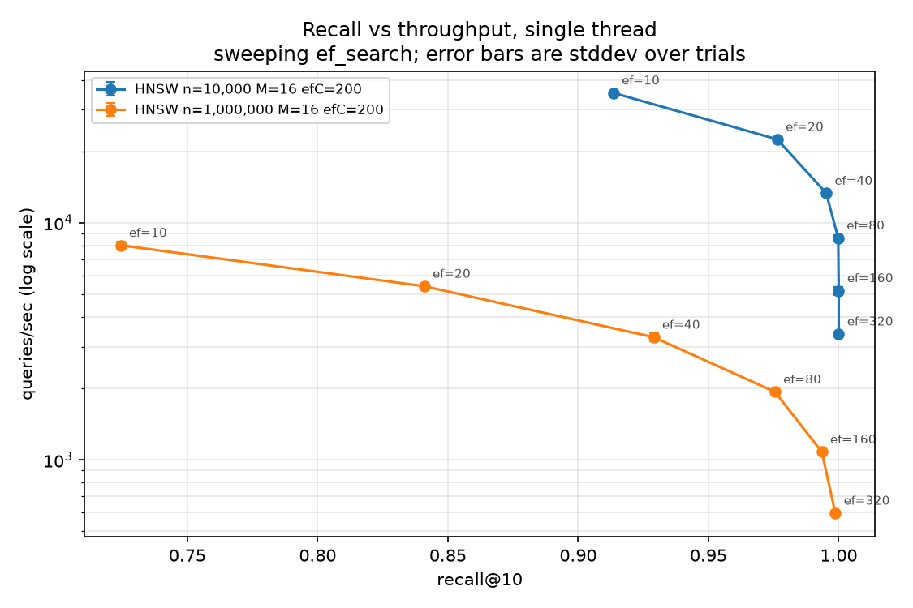
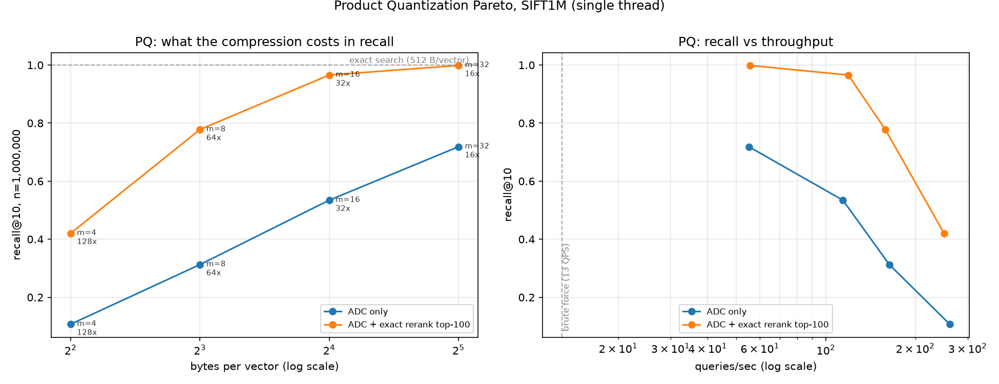
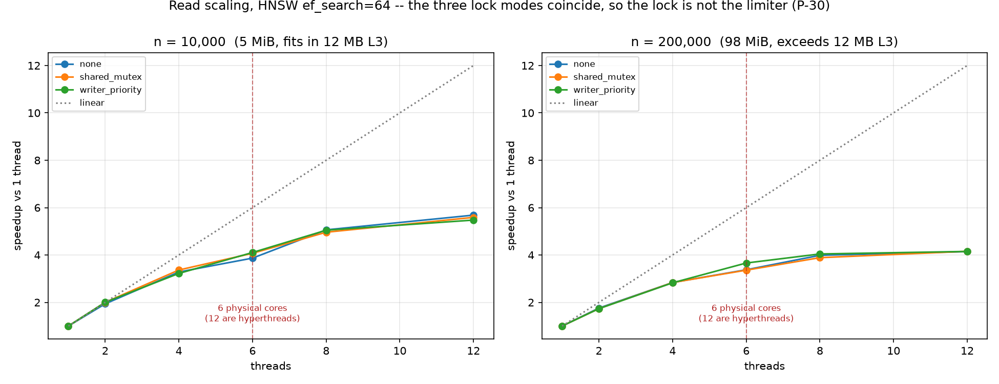
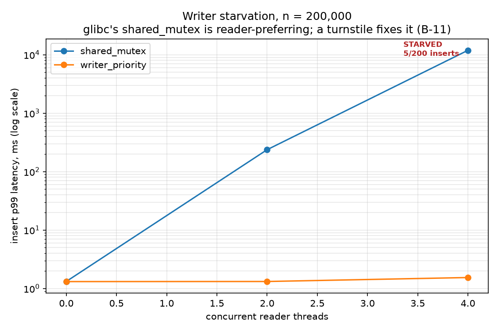
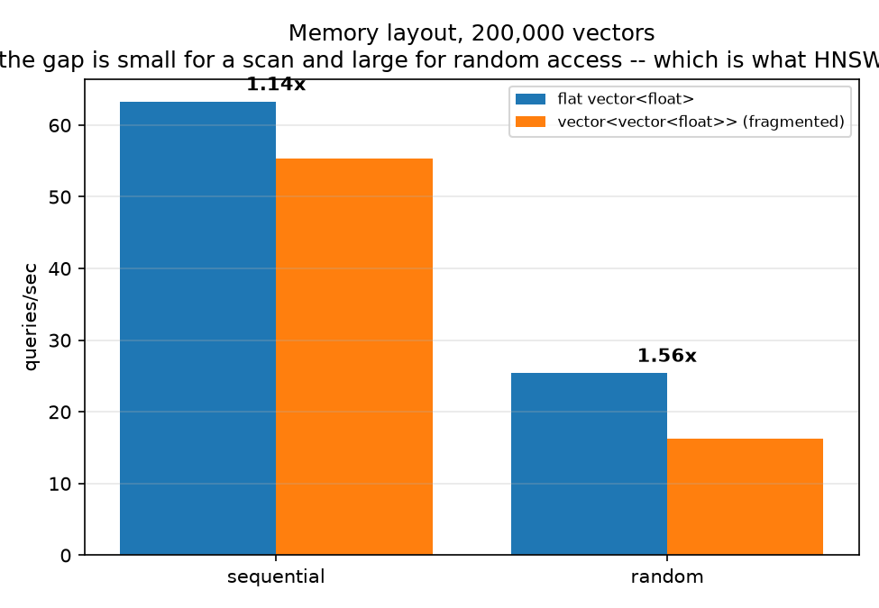
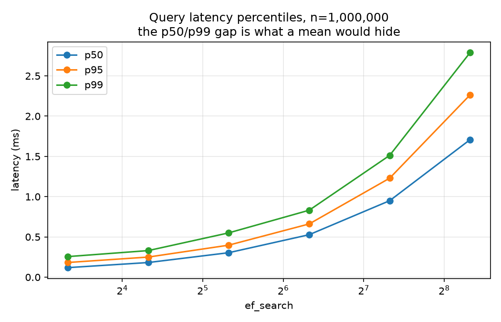
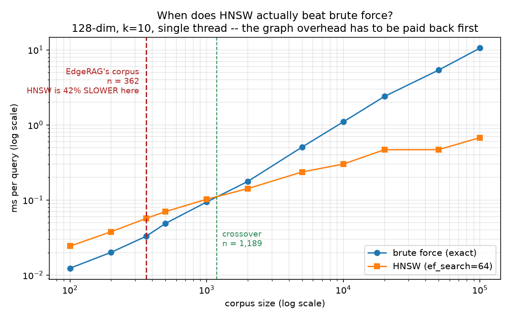

# VecCore

**An HNSW vector index with Product-Quantization compression and hybrid dense+sparse retrieval,
written from scratch in C++17 and benchmarked against FAISS.**

> **Status: complete.** All six phases shipped and gated. HNSW, Product Quantization, BM25+RRF
> and concurrent search, benchmarked head-to-head against FAISS on identical data with matched
> parameters and matched thread counts.
> This README is deliberately empty of numbers. Every claim below the line will arrive with a JSON
> record in [`results/`](results/) and the git SHA that produced it — see `CONTEXT.md` D10. If you
> are reading this and a number has no record behind it, that is a bug in the README.

New to vector search? **[`WHAT_IS_THIS.md`](WHAT_IS_THIS.md)** explains the whole problem from zero
background — what a vector is, why brute force fails, and what HNSW and PQ actually do.

| Document | What it holds |
|---|---|
| [`WHAT_IS_THIS.md`](WHAT_IS_THIS.md) | The no-background explanation, and the honest answer to "isn't this solved?" |
| [`PLAN.md`](PLAN.md) | Phase-by-phase build plan, schedule, cut order, gates |
| [`CONTEXT.md`](CONTEXT.md) | Every design decision with the alternative that was rejected |
| [`BUGS.md`](BUGS.md) | Bug log, defused landmines, and ~35 pre-registered failure modes |
| [`02_VECCORE.md`](02_VECCORE.md) | The original specification |

---

## Build

Linux only, and deliberately so — `CONTEXT.md` D2 records why (sanitizers, TSan, valgrind, and a
clean pybind11 story; `BUGS.md` L-01 is the finding that forced it).

```bash
sudo apt install -y build-essential cmake ninja-build valgrind python3-venv python3-pip pkg-config
```

Release — the only configuration any published number may come from:

```bash
cmake -S . -B ~/veccore-build -G Ninja -DCMAKE_BUILD_TYPE=Release && cmake --build ~/veccore-build
```

Debug, with AddressSanitizer and UBSan on by default:

```bash
cmake -S . -B ~/veccore-build-debug -G Ninja -DCMAKE_BUILD_TYPE=Debug && cmake --build ~/veccore-build-debug
```

**The Phase 0 gate.** This must abort with a heap-buffer-overflow report. If it prints
`probe survived`, the sanitizers are not active and the plan's main defence against memory bugs is
imaginary:

```bash
~/veccore-build-debug/bin/asan_probe
```

**ThreadSanitizer** is a third, separate build (TSan and ASan cannot coexist):

```bash
cmake -S . -B ~/veccore-build-tsan -G Ninja -DCMAKE_BUILD_TYPE=RelWithDebInfo -DVECCORE_TSAN=ON && cmake --build ~/veccore-build-tsan
```

`setarch -R` is **not optional** — TSan maps shadow memory at fixed addresses and this kernel's
ASLR range overlaps them, aborting at startup nondeterministically (`BUGS.md` L-09). The
personality flag is inherited by children, so wrapping `ctest` covers every test:

```bash
setarch -R ctest --test-dir ~/veccore-build-tsan --output-on-failure
```

And the Phase 5 gate — this one must *report a race*, proving TSan is genuinely active:

```bash
setarch -R ~/veccore-build-tsan/bin/tsan_probe
```

Python side — Ubuntu 24.04 enforces PEP 668, so this needs a venv rather than a bare
`pip install`:

```bash
python3 -m venv ~/veccore-venv && ~/veccore-venv/bin/pip install numpy matplotlib faiss-cpu pybind11
```

FAISS is a **benchmark, not a dependency** (`02_VECCORE.md` §2). It is imported only by
`bench/faiss_baseline.py`, never by anything in `include/` or `src/`.

## Data

```bash
bash scripts/fetch_sift.sh && ~/veccore-venv/bin/python scripts/make_fixture.py
```

SIFT1M (1M × 128-dim, published ground truth) for benchmarks; a 10,000-vector fixture with exact
ground truth for tests. `CONTEXT.md` D3 explains why those are two different things.

## Test and measure

```bash
ctest --test-dir ~/veccore-build --output-on-failure
```

```bash
~/veccore-build/bin/bench --tag phase0_rails --data-dir ~/veccore-data
```

`bench` refuses to write a record from a Debug, sanitized, or dirty-tree build unless you pass
`--allow-untrusted`, which stamps `trusted: false` and the reason into the record. An ASan build
runs several times slower than Release, and a latency copied out of one is indistinguishable from a
real regression once it reaches a plot.

---

## Architecture

*Diagram arrives at Phase 6. Placeholder rather than a lie: nothing but the rails exists yet.*

## Benchmarks

i5-11400H, **single thread**, Release `-O3 -march=native`, WSL2 Ubuntu 24.04, GCC 13.3.
Every row traces to a record in [`results/bench.jsonl`](results/bench.jsonl) carrying the git SHA,
CPU, compiler, flags, RNG seed and parameters it was produced under. Regenerate with
`bench/plots.py`; nothing here is typed by hand.



**SIFT1M — 1,000,000 × 128, published ground truth, k=10**

| index | params | recall@10 | QPS | p50 | p99 | vs brute force |
|---|---|---|---|---|---|---|
| brute force | exact | 0.9995 † | 12.9 ± 0.7 | 76.0 ms | 103.6 ms | 1× |
| HNSW | ef=40 | 0.9290 | 3,288 ± 138 | 0.30 ms | 0.55 ms | 254× |
| **HNSW** | **ef=80** | **0.9755** | **1,934 ± 15** | **0.53 ms** | **0.83 ms** | **150×** |
| HNSW | ef=160 | 0.9935 | 1,079 ± 10 | 0.95 ms | 1.51 ms | 83× |
| HNSW | ef=320 | 0.9987 | 595 ± 15 | 1.71 ms | 2.79 ms | 46× |

† Brute force is exact by construction. The 0.9995 is **one distance tie in 2000**, not an error:
query 93's published neighbour 274922 and our 196106 sit at d² = 42192.0 exactly, and an independent
numpy implementation makes the same choice. `scripts/diagnose_recall.py` proves it rather than
asserting it — that script is the answer to "why isn't it 1.0?".

**Build, memory, and the graph itself** (M=16, ef_construction=200, seed=42):

| | |
|---|---|
| build time | **1,139 s** single-threaded — see limitations, this is the weakest number here |
| level histogram | 1,000,000 / 62,312 / 3,911 / 250 / 21 / 1 |
| successive ratios | 0.0623, 0.0628, 0.0639 — against the predicted 1/M = 0.0625 |
| mean degree, layer 0 | 25.7 (cap 32) |
| graph | 140.7 MiB on top of 488.3 MiB of vectors — **28.8% overhead** |

The level histogram is not decoration. `mL = 1/ln(M)` is easy to get wrong (`1/M` and `ln(M)` are
both plausible), nothing errors when you do, and the only symptom is a badly shaped hierarchy. The
ratios matching 1/M to three decimal places is the evidence that it is right.

### Head-to-head with FAISS — SIFT1M, matched `M`/`ef_construction`/`ef_search`, both single-threaded

This is the table the project exists to be able to show. `02_VECCORE.md` set the bar at
*"within 2–3× of FAISS is a good solo result."*

| ef_search | VecCore recall@10 | FAISS recall@10 | VecCore QPS | FAISS QPS | FAISS faster by |
|---|---|---|---|---|---|
| 10 | 0.7244 | 0.7044 | 8,033 | 14,001 | 1.74× |
| 40 | 0.9290 | 0.9288 | 3,288 | 5,739 | 1.75× |
| **80** | **0.9755** | 0.9770 | **1,934** | 3,216 | **1.66×** |
| 160 | 0.9935 | 0.9946 | 1,079 | 1,778 | 1.65× |
| 320 | 0.9987 | 0.9987 | 595 | 956 | 1.61× |
| **build** | | | **1,139 s** | **753 s** | **1.51×** |

**Recall matches to within 0.002 at every point on the curve** — slightly ahead at low `ef_search`,
slightly behind at high. That is the correctness result: this HNSW builds a graph of equivalent
quality to the reference implementation. Throughput is **1.6–1.75× behind**, inside the spec's
target band, and build time is 1.51× behind.

`faiss.omp_set_num_threads(1)` is set explicitly (P-32) — FAISS defaults to every core, and
comparing that against a single-threaded search would be a 6× error in its favour and the first
thing anyone competent would ask about.

**PQ, same treatment** — `IndexPQ`, same `m`, same 100k training subsample:

| m | compression | VecCore recall@10 | FAISS recall@10 | VecCore QPS | FAISS QPS |
|---|---|---|---|---|---|
| 8 | 64× | **0.3125** | 0.3101 | 164 | 191 |
| 32 | 16× | **0.7186** | 0.7059 | 55 | 62 |

Marginally ahead of the reference on recall, at 0.85–0.89× its throughput.

### Product Quantization — compression, and what it costs



| m | B/vector | compression | ADC recall@10 | **+ exact rerank top-100** | ADC QPS |
|---|---|---|---|---|---|
| 4 | 4 | 128× | 0.1071 | 0.4202 | 261 |
| 8 | 8 | 64× | 0.3125 | 0.7779 | 164 |
| 16 | 16 | 32× | 0.5344 | **0.9656** | 114 |
| 32 | 32 | 16× | 0.7186 | **0.9987** | 55 |

Reconstruction MSE falls monotonically with `m` — 39924 → 24165 → 10847 → 3665 — which is the
check that the subspace slicing is right.

**Against FAISS `IndexPQ`, same data, same `m`, both pinned to one thread:**

| m | VecCore recall@10 | FAISS recall@10 | VecCore QPS | FAISS QPS | codebook train |
|---|---|---|---|---|---|
| 8 | **0.3125** | 0.3101 | 164 | 191 (1.17×) | 86.5 s vs **1.7 s** |
| 32 | **0.7186** | 0.7059 | 55 | 62 (1.12×) | 114.2 s vs **3.7 s** |

Recall marginally ahead of the reference implementation, throughput at 0.85–0.89× of it, and
codebook training **50× slower** — see limitations, that gap is real and has a known cause.

**PQ is a memory result, not a speed result**, and that distinction is the point. It gives 16–128×
compression but only 4–20× speed over brute force — nothing like HNSW's 150×. That is not a
shortfall, it is what PQ *is*: it still scans all one million codes, it just makes each comparison
cheaper (4–32 bytes read instead of 512). **HNSW wins by not looking at most of the data; PQ wins by
making all of the data small.**

One honesty item, enforced in the harness rather than trusted to prose: **reranking needs the full
vectors resident**, so a reranking configuration's real footprint includes all 488 MB. `bench`
records code bytes, codebook bytes and total footprint as separate fields and never conflates them.
Quoting 64× compression for a configuration that keeps the uncompressed vectors in RAM would be
exactly the overclaiming `WHAT_IS_THIS.md` §10 criticises.

### Hybrid retrieval — BM25 on EdgeRAG's real corpus

362 documents, **650 real held-out queries**, measured against EdgeRAG's own TF-IDF implementation
with an identical tokenizer, so the comparison isolates the three things that actually differ.

| retriever | recall@1 | recall@5 | recall@10 | ÷ ceiling | p50 latency |
|---|---|---|---|---|---|
| TF-IDF (EdgeRAG today) | 0.0400 | 0.1846 | 0.2738 | 48.0% | 0.0359 ms |
| **BM25 (VecCore)** | **0.0446** | **0.1923** | **0.2862** | **50.0%** | **0.0034 ms** |
| RRF(BM25, TF-IDF) | 0.0400 | 0.1862 | 0.2769 | 48.4% | 0.0432 ms |

**BM25 wins on both axes: +4.17% relative recall@5 and 11× lower latency.** The latency half is
algorithmic rather than a micro-optimisation — an inverted index touches only documents containing
a query term, while the TF-IDF implementation scores all 362.

**The ceiling column is not decoration.** 112 of 362 documents have no OCR text at all, so 400 of
650 queries are unreachable by *any* text retriever. **No text-only method can exceed recall
0.3846 on this corpus.** Quoting these numbers against 1.0 would make a 50%-of-achievable result
look like a 19% failure.

**RRF made things worse, and that is reported rather than dropped.** `PLAN.md` §4.5 pre-committed
to reporting the result either way, before it was known. The investigation:

```
mean top-10 overlap between BM25 and TF-IDF : 0.4915
BM25 finds the gold doc, TF-IDF does not    :  13 queries
TF-IDF finds it, BM25 does not              :   8 queries

oracle fusion recall@5 (always pick correctly) : 0.2046
BM25 alone                                     : 0.1923
RRF                                            : 0.1862
```

So complementary signal genuinely exists — **+6.4% is on the table** — and RRF captures none of it.
**RRF fuses by rank alone, which is exactly what makes it tuning-free and also what makes it
authority-blind:** it has no way to know one input dominates, so it averages a stronger ranker with
a weaker one that mostly agrees. That is the right bet for *complementary* retrievers and the wrong
one for *correlated* ones. Full write-up in [`BUGS.md`](BUGS.md) B-08.

A genuine dense+sparse hybrid could not be measured here — EdgeRAG's dense signal was measured to
be noise (`DEFAULT_ALPHA = 0.0`), so the only second retriever available is another lexical one
over the same tokens. That is a limitation of the data, named rather than substituted with a
number that flatters.

### Concurrency — read scaling, and a lock that stopped accepting writes



Read-only throughput, HNSW `ef_search=64`, 3 trials, each thread taking a **disjoint** slice of the
query set (P-28 — all threads issuing the same query would measure cache behaviour, not
concurrency):

| threads | n=10K (4.9 MiB, fits in 12 MB L3) | n=200K (98 MiB, exceeds L3) |
|---|---|---|
| 1 | 10,347 QPS (1.00×) | 3,651 QPS (1.00×) |
| 2 | 20,701 (2.00×, 100%) | 6,341 (1.74×, 87%) |
| 4 | 34,829 (**3.37×**, 84%) | 10,357 (**2.84×**, 71%) |
| 6 | 42,129 (4.07×, 68%) | 12,267 (3.36×, 56%) |
| 8 | 51,332 (4.96×, 62%) | 14,195 (3.89×, 49%) |
| 12 | 57,825 (5.59×, 47%) | 15,172 (4.16×, 35%) |

**The lock is not what limits scaling, and there is a control that proves it.** Running the same
sweep with the lock *entirely removed* gives 14,994 QPS at 200K/12 threads against 15,172 with
`shared_mutex` — a ~3% spread, inside trial noise. `BUGS.md` P-30 pre-registered the trap:
*"it stops scaling because of lock contention"* is the plausible sentence, and it is **wrong here**.

What does limit it, isolated by changing only the working-set size: the out-of-cache curve loses
**~12 points of efficiency at every thread count**, which is memory bandwidth. Past 6 threads both
curves flatten, because threads 7–12 are hyperthreads sharing execution units with a loop that
already saturates them — 8→12 threads buys 3.89→4.16×. Turbo clock reduction as more cores
engage is a third contributor and is not separated out; saying so beats attributing the residual to
whichever cause sounds best.

### The bug worth reading: 4 readers stop the index accepting writes



`std::shared_mutex` on libstdc++ is a `pthread_rwlock_t`, and **glibc's default is
reader-preferring**. Under continuous search load the reader count never reaches zero, so a writer's
`unique_lock` never becomes grantable. Measured, 200 inserts at n=200K:

| lock mode | readers | inserts completed | insert p50 | insert p99 |
|---|---|---|---|---|
| `shared_mutex` | 0 | 200/200 | 0.70 ms | 1.32 ms |
| `shared_mutex` | 2 | 200/200 | 28.40 ms | 237 ms |
| **`shared_mutex`** | **4** | **5/200 in 36 s** | **8,242 ms** | **11,902 ms** |
| `writer_priority` | 0 | 200/200 | 0.70 ms | 1.31 ms |
| `writer_priority` | 2 | 200/200 | 0.75 ms | 1.32 ms |
| **`writer_priority`** | **4** | **200/200 in 159 ms** | **0.76 ms** | **1.54 ms** |

Not a slowdown — a cliff. The fix is a ~10-line turnstile: a plain mutex that readers touch briefly
on the way in and that a **writer holds across its whole wait**, so new readers queue behind it
instead of overtaking it. Insert p99 under 4 readers goes **11,902 ms → 1.54 ms**, and the read
scaling table above shows it costs read throughput nothing measurable. It is now the default.
Full write-up in [`BUGS.md`](BUGS.md) B-11.

A vector index is *the* canonical many-readers-occasional-writer workload, which makes this the
wrong standard-library default for exactly this use case — and `std::shared_mutex` exposes no way
to change it.

**Verified with ThreadSanitizer**, and TSan itself is verified: `tools/tsan_probe.cpp` deliberately
calls the non-thread-safe overload from 4 threads and TSan reports the expected race on the epoch
counter. A clean sanitizer run proves nothing unless the sanitizer can be shown to fire (B-10, L-01).

**Memory layout (D5)** — 200,000 vectors, 98 MiB, past this CPU's 12 MB L3:



| access pattern | flat | naive `vector<vector<float>>` | flat advantage |
|---|---|---|---|
| sequential | 63.3 QPS | 55.3 QPS | 1.14× |
| random | 25.4 QPS | 16.2 QPS | **1.56×** |

Layout barely matters for a sequential scan — the prefetcher handles both. It matters under random
access, **which is what HNSW does**, since graph traversal visits neighbours in an order no
prefetcher can predict. The first version of this benchmark reported the naive layout as *faster*;
`BUGS.md` B-05 explains why, and that half is more interesting than the result.



The FAISS head-to-head arrives in Phase 6, measured in the same session on the same machine with
matched thread counts, interleaved A/B/A/B.

### Integrating with EdgeRAG — three claims that survive a follow-up question



`python/veccore/edgerag.py` implements EdgeRAG's `RetrievalIndex` protocol — the one whose docstring
was written months before this repo existed and reads *"``VecCore`` implements this later without
touching a caller."* It does, and no call site changes.

The pitch everyone reaches for is "VecCore made EdgeRAG's retrieval faster with HNSW." **It is
false, and `bench/crossover.py` measures exactly how false:**

| n | brute force | HNSW | |
|---|---|---|---|
| **362** | **0.0330 ms** | **0.0570 ms** | **HNSW is 42% SLOWER — EdgeRAG's actual corpus** |
| 1,189 | — | — | crossover |
| 10,000 | 1.0985 ms | 0.3012 ms | 3.65× |
| 100,000 | 10.5510 ms | 0.6786 ms | 15.55× |

EdgeRAG's corpus sits **3.3× below the crossover**. Graph traversal costs more than the scan it
avoids. So the three claims actually delivered are:

1. **No regression** — same protocol, same call sites, recall at least as good as the TF-IDF index
   it replaces. Checked in `tests/test_edgerag_adapter.py` against the real 650-query set.
2. **A real quality upgrade** — TF-IDF → BM25, **+4.17% relative recall@5** at **11× lower
   latency**, measured above.
3. **A scaling argument that is measured rather than asserted** — the curve above, with EdgeRAG's
   position marked on it.

`use_hnsw` therefore defaults to **False** in the adapter. Turning it on at 362 documents would make
retrieval slower for the sake of a nicer architecture diagram.

## Using it from Python

```python
import veccore

index = veccore.HnswIndex(vectors, M=16, ef_construction=200)   # (n, dim) float32
ids, distances = index.search(query, k=10, ef_search=64)        # squared L2
```

The GIL is released around every search (P-35), so threading through the binding actually overlaps:
**4 threads take 1.35× the single-threaded time for 4× the work**. A held GIL would show 4.0×, and
nothing in the C++ benchmark would have noticed — which is why `tests/test_bindings.py` exists.

## Design decisions

See [`CONTEXT.md`](CONTEXT.md). The ones most worth reading: D4 (squared L2, and why cosine is not
a third code path), D5 (flat arrays with fixed stride, and what that costs), D6 (the from-scratch
boundary), D10 (what makes a number publishable).

## Known limitations

Written before the code, because the list is already knowable and a limitations section added at
the end is a limitations section that flatters:

- **No deletes.** Tombstones + periodic rebuild is the design; removing a node in place severs the
  links that pass *through* it and quietly damages navigability for every other query.
- **Single node, memory resident.** 1M vectors fit in RAM. Nothing here addresses what changes at
  1B — sharding, disk-based indexes, DiskANN.
- **No filtered search.** "Nearest neighbours, but only documents from 2024" has no clean answer in
  this design, and no clean answer in the field either.
- **PQ codebooks trained on a subsample**, which is standard practice and will be stated with the
  sample size rather than left implicit.
- **Approximate with no bound.** Recall is measured on a test set. Nothing guarantees it holds on
  data that drifts.
- **Concurrent *insert* is coarse-grained.** One lock for the whole index, so inserts serialise
  against each other and against all readers. The finer design — per-node link locks plus an atomic
  entry point — is described in `concurrent.hpp` with its specific hazard, and was not built: a
  subtle race in a graph mutation path produces a corrupted index that still returns k results, and
  no assertion in this repo would catch it.
- **Read scaling tops out around 4.2× on 6 cores** at a memory-resident working set. Memory
  bandwidth, not the lock — measured, see above.
- **The spec's "+3–10% hybrid recall lift" target is not achievable on the available data.**
  It needs a dense retriever that is complementary to the sparse one; EdgeRAG's dense signal is
  measured noise. BM25-over-TF-IDF (+4.17%) is what this corpus can actually demonstrate.
- **PQ codebook training is 50× slower than FAISS** (86.5 s vs 1.7 s at m=8). The cause is known
  and specific: our k-means assignment step is a triple loop over (points × centroids × dims),
  while FAISS expresses the same step as a matrix multiply and hands it to BLAS. Writing a blocked
  GEMM was out of scope for the time available (`PLAN.md` §0.3); `n_init=3` restarts also triple
  the cost by design (B-07). Reported, not excused.
- **Build time is 1,139 s for SIFT1M, single-threaded — 1.51× FAISS's 753 s** on identical
  parameters. Three known causes: insertion is single-threaded; the backward link shrink recomputes
  a neighbour's whole distance list on every overflow where hnswlib caches them; and
  `select_neighbors_heuristic` is O(M²) distance calls per insert with no reuse. *(An earlier draft
  of this line claimed FAISS was ~10× faster here, generalising from the PQ result. It was wrong and
  it was in the limitations section, which is the worst place in the repo to guess — B-12.)*
- Plus whatever `PLAN.md` §0.3's cut order takes, which will be listed here by name.

## Reproducing

Every plot regenerates from the JSONL records in `results/`. Every record carries the git SHA, CPU
model, compiler version, exact flags, thread count, dataset, and RNG seed it was produced under.
